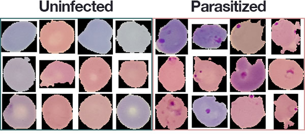
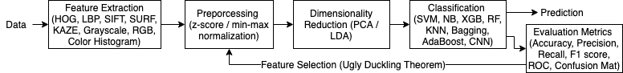
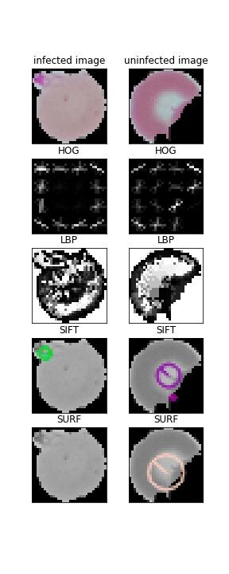
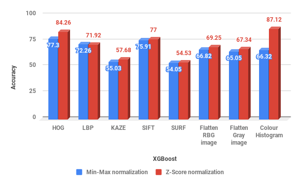
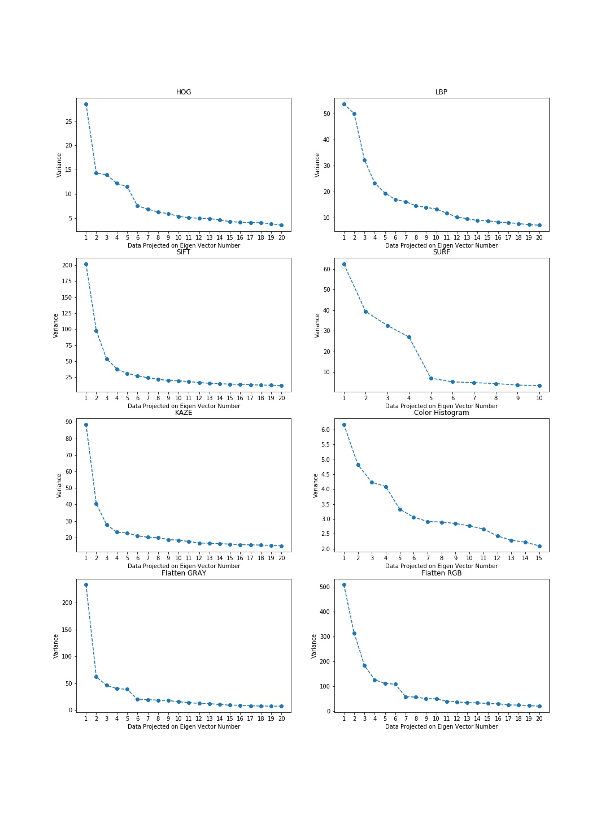
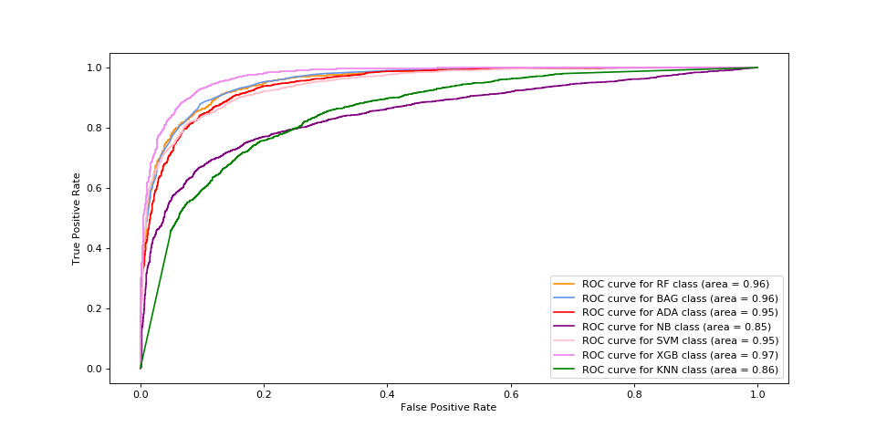
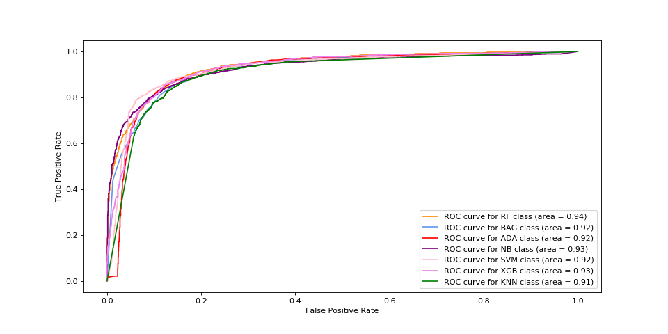
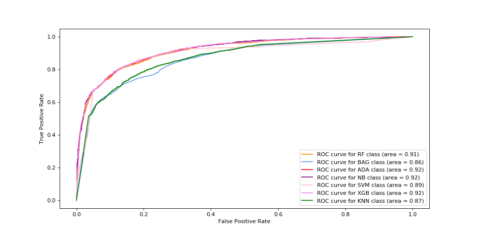
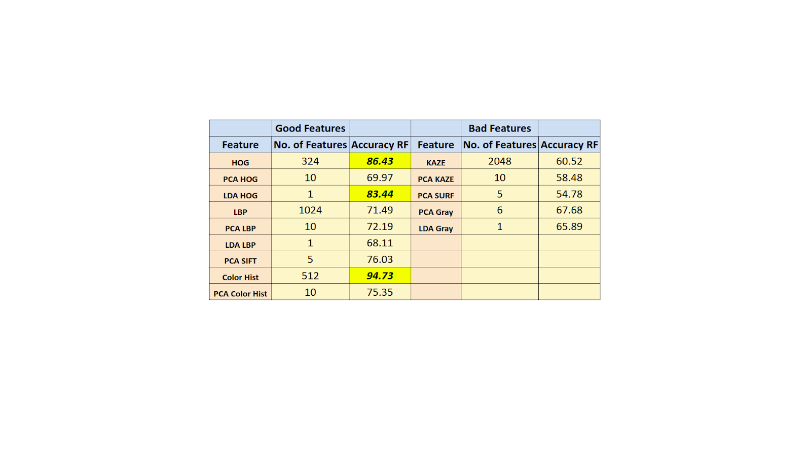
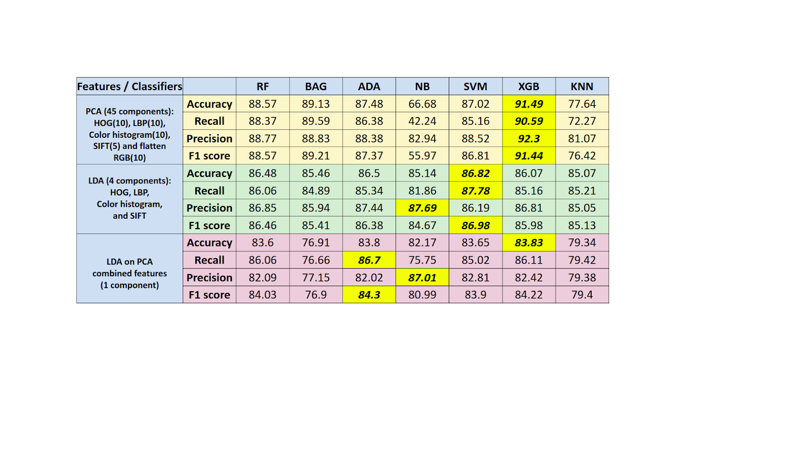

# SML-Malaria-Detection

## Project Overview

This project is done as a part of `Statistical Machine Learning` Course.

In this project our aim is to identify whether a cell is malaria infected or not. We show an in breadth & depth analysis of various features like **HOG, LBP, SIFT, SURF, pixel values** with feature reduction techniques **PCA, LDA** along with normalization techniques such as **z-score** and **min-max** over different classifiers such as **Naive Bayes, SVM XGBoost, Bagging, AdaBoost, K-Nearest Neighbors, Random Forests** and compare their performance by tuning different hyperparameters. We evaluate the performance of these classifiers on metrics such as **Accuracy, Precision, Recall, F1 score and ROC**.

Project Poster can be found in [MT18020_MT18033_SML-Poster-Final.pdf](MT18020_MT18033_SML-Poster-Final.pdf).

Project Report can be found in [SML_Project_EndTerm_Report.pdf](SML_Project_EndTerm_Report.pdf).

## Dataset

The dataset consists of 27,558 cell images; 13,780 images of infected and uninfected cells each and is taken from the official [NIH Website](https://ceb.nlm.nih.gov/repositories/malaria-datasets/).
You may also download it from [kaggle](https://www.kaggle.com/iarunava/cell-images-for-detecting-malaria).

## Algorithm Used

- Different combinations of feature sets were used, some of which are shown in Table 1 & 2 (**Ugly Duckling Theorem**) many other combinations were tried.
- Evaluated with different classifiers, model parameters were varied using **Grid Search** to find the best parameters (**No Free Lunch Theorem**).
- In PCA, number of components were preserved using **Elbow method over variance of PCA projected data** (Fig. 4).

## Evaluation Metrics and Results

Follwing are the results of the project:

                                        Fig 1. Feature Visualization
   

                                         

                                Fig 2. Comparison between Min-Max and Z-score normalization
   

                                Fig 3. Variance of PCA projected z-score normalized data

                                Fig 4. Receiver Operating Characteristic (ROC) Curves
                                    a. ROC of PCA reduced data
                                    b. ROC of LDA reduced data
                                    c. ROC of LDA on PCA reduced data

    
    
    

                    Table 2. Good and Bad features on the basis of Accuracy on Random Forest classifier

        Table 1. Comparing various classifiers with different feature sets over Accuracy/Recall/Precision/F1 score

## Interpretation of Results

- Z-score normalization gave better accuracy than min-max normalization (Fig. 8).
- Features were said to be bad because of close to random accuracy i.e. no
differentiating capability.
- Naive Bayes though gives good precision, performs poorly on infected class (recall).
- XGBoost on PCA projected feature set (HOG, LBP, Color Hist, SIFT & RGB) gave the
best metric scores because boosting methods learn for misclassified data as well
and XGB parameters (regularization, gradient descent) help learn better.
- AUC for ROCs of uninfected class show that the trained models are able to
differentiate well.
- Table 2. shows the bad features which are close to random in classification (KAZE).

## References

1. Daz, Gloria & Gonzlez, Fabio & Romero, Eduardo. (2007). Infected Cell Identification in Thin Blood Images Based on Color Pixel Clas- sification: Comparison and Analysis. 4756.812-821.10.1007/978-3-540- 76725-1 84.
2. Malihi, L., Ansari-Asl, K. & Behbahani, A. (2013). Malaria parasite de- tection in giemsa-stained blood cell images. 2013 8th Iranian Conference on Machine Vision and Image Processing (MVIP), 360-365.
3. Poostchi, Mahdieh & Silamut, Kamolrat & Maude, Richard & Jaeger, Stefan & Thoma, George. (2018). Image analysis and machine learning for detecting malaria. Translational Research. 194.10.1016/j.trsl.2017.12.004.
4. Das, D.K., Ghosh, M., Pal, M., Maiti, A.K., & Chakraborty, C. (2013). Machine learning approach for automated screening of malaria parasite using light microscopic images. Micron, 45, 97-106.
5. Gloria Daz, Fabio A. Gonzlez, and Eduardo Romero. 2009. A semi-automatic method for quantification and classification of ery- throcytes infected with malaria parasites in microscopic images. J. of Biomedical Informatics 42, 2 (April 2009), 296-307.

## Project Team Members

1. Anubhav Shrimal
2. Vrutti Patel